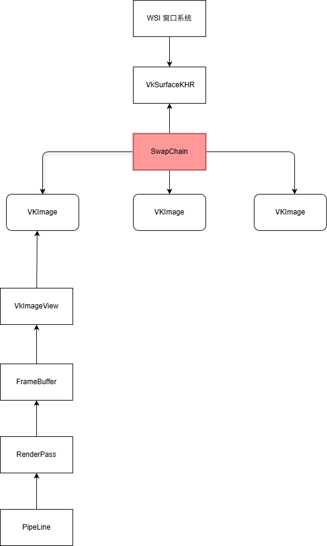

# SwapChain

`Vulkan` 交换链 (`VkSwapchainKHR`) 是 Vulkan API 中一个至关重要的基础设施， 它负责将 GPU 渲染完成的图像高效、同步地呈现给用户屏幕。
其核心目的是消除屏幕撕裂 (screen tearing)，并管理一组可用于渲染的图像缓冲区（Back Buffers）。

交换链是 Vulkan 中连接 GPU 渲染结果与窗口系统显示的核心机制。


- 应用程序请求一张空闲的图像；
- 显示系统从中获取图像进行显示

```C++

1. vkAcquireNextImageKHR   ← 获取可写的交换链图像
2. 等待上一帧 fence
3. 记录命令缓冲（渲染到该 image）
4. vkQueueSubmit           ← 提交渲染
5. vkQueuePresentKHR       ← 显示

```

## 创建交换链

- 先创建一个 VkSurface(这是和平台相关的)
- 查询物理设备的能力;
- 根据物理设备的能力创建交换链
- 记得保存一些查询的信息
    - 交换链图像
    - 图像格式
    - ......
